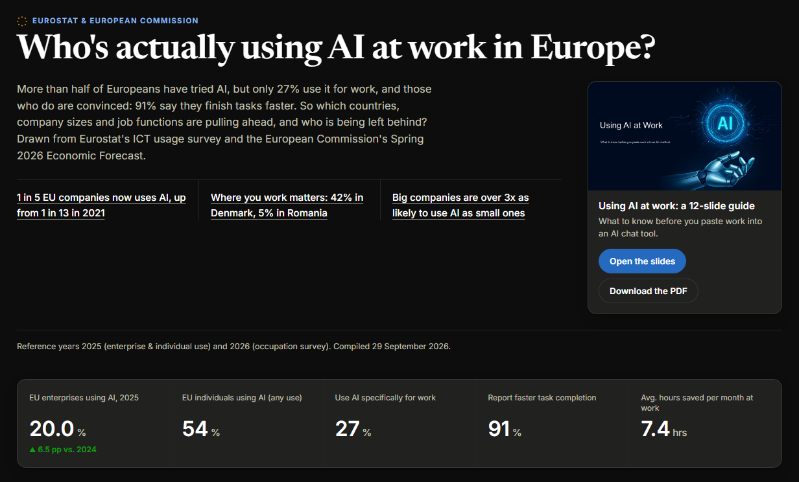

# Who's actually using AI at work in Europe? An EU Power BI case study

An end-to-end BI project: sourcing official EU statistics on AI adoption at work, modeling them in a Power BI semantic model, building a report, and prototyping the same story as a standalone HTML dashboard, paired with a "using AI safely at work" guidance deck.

**Live:** [dashboard](https://sansanabria.github.io/ai-adoption-eu/) · [AI-at-work slide deck](https://sansanabria.github.io/ai-adoption-eu/presentation.html) (GitHub Pages, served from `/docs`) · downloads: [slides PDF](docs/downloads/using-ai-at-work-slides.pdf), [LinkedIn carousel PDF](docs/downloads/using-ai-at-work-linkedin.pdf).

[](https://sansanabria.github.io/ai-adoption-eu/)

## What's in here

| Path | What it is |
|---|---|
| `AI Adoption EU.pbip` + `.SemanticModel` / `.Report` | The Power BI project (PBIP format, open with Power BI Desktop) |
| `Data/` | The source CSVs the semantic model imports, plus the two raw Eurostat exports they were derived from |
| `docs/index.html` (+ `styles.css`, `dashboard.js`) | Standalone HTML version of the dashboard: same data, a tile map of the EU, tooltips, phone-friendly; no Power BI required to view |
| `docs/presentation.html` | The guidance deck as a keyboard-navigable web presentation (←/→, `#N` deep links, PDF download) |
| `docs/downloads/` | The deck as a 16:9 PDF, and as a 10-page portrait carousel (1080×1350) for LinkedIn document posts |
| `design/linkedin-carousel.html` | Source of the LinkedIn carousel; print it with headless Chrome or Edge to rebuild the PDF |
| `tools/` | `build_charts.py` regenerates the dashboard's charts from `Data/`; `check_dashboard.py` confirms every number on the page matches the CSVs |
| `AI At Work.pptx` | Guidance deck on using AI chat tools safely (terms, account-tier risks, what not to paste into a prompt, hallucinations, ownership of AI-written work) |

## Data sources

All figures are pulled from official EU statistical releases, with no scraped or synthetic data:

- **Eurostat**, *"Use of artificial intelligence in enterprises"* (`isoc_eb_ai`, `isoc_eb_ain2`), 2025 reference year, published 11 Dec 2025: enterprise adoption by year, country, size, business function, and economic sector.
- **Eurostat**, *"Individuals: use of generative AI tools"* (`isoc_ai_iaiu`), 2025 reference year: generative-AI use by purpose (private / work / education), by country.
- **European Commission, DG ECFIN**, *"The AI-adoption divide: who benefits, who doesn't, and what it means for workers"*, Spring 2026 Economic Forecast, an ad-hoc module of the EC's monthly consumer survey (Feb–Mar 2026, n=21,207, 18 EU member states + 4 candidate countries) covering occupation-level time savings and productivity impact.

Eurostat figures were pulled directly from Eurostat's public API (dataset codes above); the European Commission figures were compiled by hand from the published report, since it has no machine-readable data release.

## Power BI model

- Import-mode semantic model, one table per CSV, no relationships (each table is a self-contained pre-aggregated view: country, sector, business function, enterprise size, occupation, etc.)
- Explicit DAX measures per table (no implicit aggregation), `Decimal` types instead of `Double` for percentage/hour columns, hidden base columns behind their measures
- A small disconnected `# Measures` table for cross-table KPIs (latest adoption %, YoY growth, top country/function)
- Report theme (`EUAdoption-*.json`) built from the same color palette as the HTML version

**Setup after cloning:** every table reads its CSV through a single Power Query parameter, `DataFolder` (default `C:\path\to\ai-adoption-eu\Data`, a placeholder). Open `AI Adoption EU.pbip` in Power BI Desktop, go to *Home → Transform data → Manage parameters*, set `DataFolder` to the full path of this repo's `Data` folder, then *Close & Apply* and refresh. That one value is the only machine-specific setting in the model.

## HTML prototype

`docs/index.html` is a dependency-free HTML/CSS page (one Google Fonts link, no framework, no chart library) built to the same design system as the Power BI report: EU blue, Newsreader/Inter, light and dark mode. The bar charts, the trend line and the EU tile map are plain HTML/CSS/SVG generated from the CSVs; a small script (`docs/dashboard.js`) adds tooltips and links each country's tile to its row in the ranked list. Colours follow the dataviz method: one blue for bars, a single-hue light-to-dark ramp for the map (label colours chosen per tile for at least 4.5:1 contrast), and a validated light-to-dark ramp for company size.

After changing anything in `Data/`, rebuild and verify the page:

```
python tools/build_charts.py
python tools/check_dashboard.py
```

## Tools used

Built with [Claude Code](https://claude.com/claude-code), using the [`skills-for-fabric`](https://github.com/microsoft/skills-for-fabric) plugin (`powerbi-authoring`) for the semantic model and report authoring, and Anthropic's `dataviz` / `artifact-design` skills for the HTML dashboard's chart and visual design.

## License

Code, HTML and slide deck: [MIT](LICENSE). The underlying data belongs to its publishers (Eurostat, European Commission) and remains subject to their reuse terms. See [Data sources](#data-sources).
